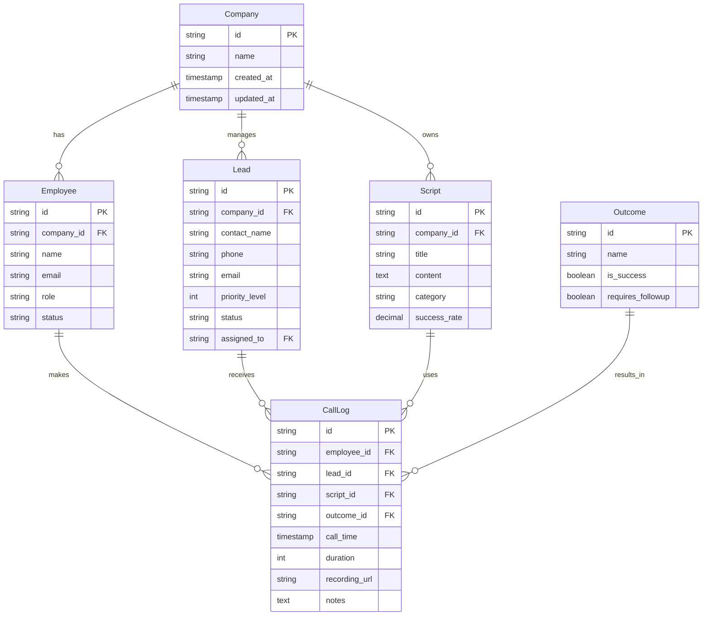

# Entity Relationship Diagram (ERD)
## 텔레마케팅 데이터 관리 플랫폼

### 1. 데이터베이스 스키마 개요

이 ERD는 텔레마케팅 플랫폼의 핵심 데이터 구조를 정의합니다. 회사별 멀티테넌시를 지원하며, 직원, 리드, 통화 기록, 스크립트 관리를 포함합니다.

### 2. 엔티티 정의

#### 2.1 Company (회사)
회사 정보를 관리하는 최상위 엔티티입니다.

| Column | Type | Constraints | Description |
|--------|------|------------|-------------|
| id | string (UUID) | PRIMARY KEY | 회사 고유 식별자 |
| name | string | NOT NULL | 회사명 |
| created_at | timestamp | NOT NULL | 생성일시 |
| updated_at | timestamp | NOT NULL | 수정일시 |

#### 2.2 Employee (직원)
회사에 소속된 직원 정보를 관리합니다.

| Column | Type | Constraints | Description |
|--------|------|------------|-------------|
| id | string (UUID) | PRIMARY KEY | 직원 고유 식별자 |
| company_id | string (UUID) | FOREIGN KEY | 소속 회사 ID |
| name | string | NOT NULL | 직원명 |
| email | string | UNIQUE, NOT NULL | 이메일 주소 |
| role | string | NOT NULL | 역할 (admin/manager/agent) |
| status | string | NOT NULL | 상태 (active/inactive/on_leave) |
| created_at | timestamp | NOT NULL | 생성일시 |
| updated_at | timestamp | NOT NULL | 수정일시 |

#### 2.3 Lead (리드/고객)
잠재 고객 정보를 관리합니다.

| Column | Type | Constraints | Description |
|--------|------|------------|-------------|
| id | string (UUID) | PRIMARY KEY | 리드 고유 식별자 |
| company_id | string (UUID) | FOREIGN KEY | 관리 회사 ID |
| contact_name | string | NOT NULL | 담당자명 |
| phone | string | NOT NULL | 전화번호 |
| email | string | | 이메일 주소 |
| company_name | string | | 고객사명 |
| priority_level | int | NOT NULL DEFAULT 0 | 우선순위 (0-10) |
| status | string | NOT NULL | 상태 (new/contacted/qualified/converted/lost) |
| assigned_to | string (UUID) | FOREIGN KEY | 담당 직원 ID |
| last_contact_date | timestamp | | 마지막 연락일 |
| next_contact_date | timestamp | | 다음 연락 예정일 |
| score | int | DEFAULT 0 | 리드 스코어 |
| notes | text | | 메모 |
| created_at | timestamp | NOT NULL | 생성일시 |
| updated_at | timestamp | NOT NULL | 수정일시 |

#### 2.4 Script (스크립트)
통화 스크립트를 관리합니다.

| Column | Type | Constraints | Description |
|--------|------|------------|-------------|
| id | string (UUID) | PRIMARY KEY | 스크립트 고유 식별자 |
| company_id | string (UUID) | FOREIGN KEY | 소속 회사 ID |
| title | string | NOT NULL | 스크립트 제목 |
| content | text | NOT NULL | 스크립트 내용 |
| category | string | | 카테고리 |
| success_rate | decimal(5,2) | | 성공률 (%) |
| usage_count | int | DEFAULT 0 | 사용 횟수 |
| is_active | boolean | DEFAULT true | 활성화 여부 |
| created_by | string (UUID) | FOREIGN KEY | 작성자 ID |
| created_at | timestamp | NOT NULL | 생성일시 |
| updated_at | timestamp | NOT NULL | 수정일시 |

#### 2.5 Outcome (통화 결과)
통화 결과 유형을 정의합니다.

| Column | Type | Constraints | Description |
|--------|------|------------|-------------|
| id | string (UUID) | PRIMARY KEY | 결과 고유 식별자 |
| name | string | NOT NULL UNIQUE | 결과명 |
| description | text | | 설명 |
| is_success | boolean | DEFAULT false | 성공 여부 |
| requires_followup | boolean | DEFAULT false | 후속 조치 필요 여부 |
| created_at | timestamp | NOT NULL | 생성일시 |

**기본 Outcome 유형:**
- success (성공)
- no_answer (부재)
- busy (통화중)
- rejected (거절)
- callback_scheduled (재통화 예정)
- wrong_number (잘못된 번호)
- disconnected (연결 끊김)

#### 2.6 CallLog (통화 기록)
모든 통화 기록을 저장합니다.

| Column | Type | Constraints | Description |
|--------|------|------------|-------------|
| id | string (UUID) | PRIMARY KEY | 통화 기록 고유 식별자 |
| employee_id | string (UUID) | FOREIGN KEY NOT NULL | 상담원 ID |
| lead_id | string (UUID) | FOREIGN KEY NOT NULL | 리드 ID |
| script_id | string (UUID) | FOREIGN KEY | 사용 스크립트 ID |
| outcome_id | string (UUID) | FOREIGN KEY NOT NULL | 통화 결과 ID |
| call_time | timestamp | NOT NULL | 통화 시작 시간 |
| duration | int | | 통화 시간 (초) |
| recording_url | string | | 녹음 파일 URL |
| notes | text | | 상담 메모 |
| sentiment_score | decimal(3,2) | | 감정 분석 점수 (-1 to 1) |
| created_at | timestamp | NOT NULL | 생성일시 |

### 3. 관계 정의

#### 3.1 1:N (One-to-Many) 관계

```
Company ──┐
          ├──< Employee
          ├──< Lead  
          └──< Script

Employee ──< CallLog
Lead ─────< CallLog
Script ───< CallLog
Outcome ──< CallLog
```

#### 3.2 관계 설명

1. **Company → Employee** (1:N)
   - 한 회사는 여러 직원을 보유
   - 직원은 반드시 하나의 회사에 소속

2. **Company → Lead** (1:N)
   - 한 회사는 여러 리드를 관리
   - 리드는 반드시 하나의 회사에 속함

3. **Company → Script** (1:N)
   - 한 회사는 여러 스크립트를 보유
   - 스크립트는 반드시 하나의 회사에 속함

4. **Employee → CallLog** (1:N)
   - 한 직원은 여러 통화 기록 생성
   - 통화 기록은 반드시 한 직원에 의해 생성

5. **Lead → CallLog** (1:N)
   - 한 리드는 여러 통화 기록 보유 가능
   - 통화 기록은 반드시 한 리드와 연결

6. **Script → CallLog** (1:N)
   - 한 스크립트는 여러 통화에서 사용 가능
   - 통화 기록은 선택적으로 스크립트와 연결

7. **Outcome → CallLog** (1:N)
   - 한 결과 유형은 여러 통화에 적용 가능
   - 통화 기록은 반드시 하나의 결과 보유

### 4. 인덱스 전략

#### 4.1 Primary Keys
- 모든 테이블의 `id` 필드

#### 4.2 Foreign Key Indexes
```sql
CREATE INDEX idx_employee_company_id ON Employee(company_id);
CREATE INDEX idx_lead_company_id ON Lead(company_id);
CREATE INDEX idx_lead_assigned_to ON Lead(assigned_to);
CREATE INDEX idx_script_company_id ON Script(company_id);
CREATE INDEX idx_calllog_employee_id ON CallLog(employee_id);
CREATE INDEX idx_calllog_lead_id ON CallLog(lead_id);
CREATE INDEX idx_calllog_script_id ON CallLog(script_id);
CREATE INDEX idx_calllog_outcome_id ON CallLog(outcome_id);
```

#### 4.3 Performance Indexes
```sql
CREATE INDEX idx_employee_email ON Employee(email);
CREATE INDEX idx_lead_phone ON Lead(phone);
CREATE INDEX idx_lead_status ON Lead(status);
CREATE INDEX idx_lead_priority ON Lead(priority_level DESC);
CREATE INDEX idx_calllog_call_time ON CallLog(call_time DESC);
CREATE INDEX idx_calllog_composite ON CallLog(employee_id, call_time DESC);
```

### 5. 데이터 무결성 규칙

#### 5.1 Cascade Rules
- Company 삭제 시: 관련 Employee, Lead, Script RESTRICT (삭제 방지)
- Employee 삭제 시: CallLog 유지 (soft delete 권장)
- Lead 삭제 시: CallLog 유지 (historical data)
- Script 삭제 시: CallLog의 script_id NULL 설정

#### 5.2 Constraints
```sql
ALTER TABLE Employee ADD CONSTRAINT chk_employee_role 
  CHECK (role IN ('admin', 'manager', 'agent'));

ALTER TABLE Lead ADD CONSTRAINT chk_lead_priority 
  CHECK (priority_level >= 0 AND priority_level <= 10);

ALTER TABLE Lead ADD CONSTRAINT chk_lead_status 
  CHECK (status IN ('new', 'contacted', 'qualified', 'converted', 'lost'));

ALTER TABLE CallLog ADD CONSTRAINT chk_duration_positive 
  CHECK (duration >= 0);

ALTER TABLE CallLog ADD CONSTRAINT chk_sentiment_range 
  CHECK (sentiment_score >= -1 AND sentiment_score <= 1);
```

### 6. 확장 가능한 추가 엔티티 (Future)

#### 6.1 Campaign (캠페인)
마케팅 캠페인 관리
```
Campaign ──< Lead
Campaign ──< Script
```

#### 6.2 Team (팀)
팀 단위 관리
```
Company ──< Team ──< Employee
```

#### 6.3 CallRecording (통화 녹음)
녹음 파일 상세 관리
```
CallLog ──┤ CallRecording
```

#### 6.4 LeadHistory (리드 이력)
리드 상태 변경 이력
```
Lead ──< LeadHistory
```

### 7. 보안 고려사항

#### 7.1 개인정보 보호
- phone, email 필드 암호화 고려
- recording_url 접근 권한 관리
- PII 데이터 마스킹 기능

#### 7.2 감사 로그
- 모든 테이블에 created_at, updated_at 필수
- 중요 작업에 대한 audit_log 테이블 고려

### 8. 성능 최적화 고려사항

#### 8.1 파티셔닝
- CallLog 테이블: call_time 기준 월별 파티셔닝
- Lead 테이블: status 기준 파티셔닝 고려

#### 8.2 아카이빙
- 6개월 이상 된 CallLog 아카이브 테이블로 이동
- 완료된 Lead 별도 테이블 관리

### 9. ERD Diagram (Mermaid)

